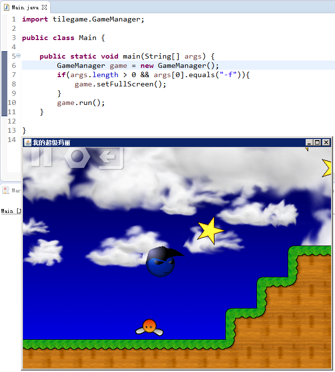
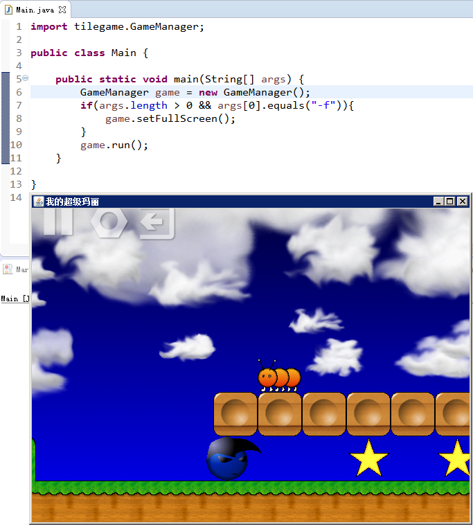
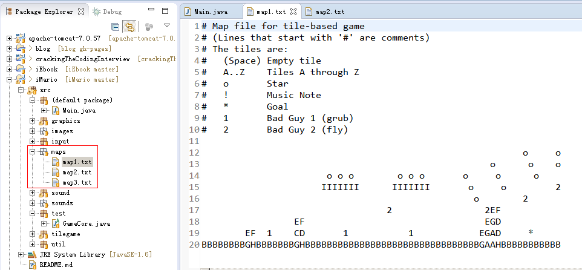

# iMario
iMario——我的超级玛丽——源自书籍《Developing Games In Java》

## Example
Run **Main.java**

Run `mvn clean compile exec:java` for Maven

### 其他功能（Others）
#### 地图编辑（Edit Map File）

#### 暂停（Pause）

#### 全屏（FullScreen）

